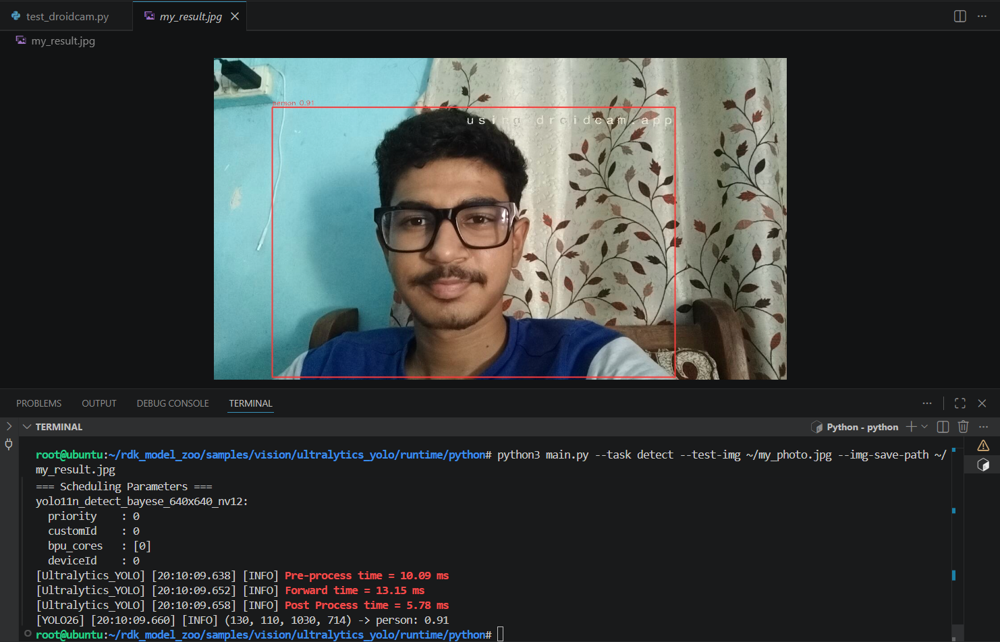

# ClassMind — Benchmark & Runtime Evidence

This document records observed runtime, AI inference, memory, sensor, and model-selection evidence for ClassMind on the D-Robotics RDK X5.

> Benchmark values in this document are prototype measurements observed during development and validation. They should not be interpreted as standardized laboratory benchmarks.

---

## 1. Test Platform

| Component | Configuration |
|---|---|
| Edge AI Board | D-Robotics RDK X5 4GB |
| Operating System | RDKOS 3.5.0 |
| AI Accelerator | RDK X5 BPU |
| Continuous Detection Model | YOLO11n |
| Face Recognition Model | InsightFace `buffalo_s` |
| CPU Face Runtime | ONNX Runtime |
| Robotics Middleware | ROS 2 Humble |
| External Controller | ESP32-S3 |
| Environmental Sensor | MQ-series analog gas sensor prototype |
| Camera Source | DroidCam / OpenCV camera stream |
| Application Interface | Flask Web Application |

---

## 2.  BPU Inference — YOLO11n

ClassMind uses a BPU-compiled YOLO11n model for person detection on the D-Robotics RDK X5.

**Model:** `yolo11n_detect_bayese_640x640_nv12.bin`  
**Input Resolution:** `640 × 640`  
**Input Format:** `NV12`  
**BPU Core:** `[0]`

### Observed BPU Inference Evidence

The following timing values were captured during prototype validation on the RDK X5:

| Pipeline Stage | Observed Time |
|---|---:|
| Pre-processing | 10.09 ms |
| BPU forward inference | 13.15 ms |
| Post-processing | 5.78 ms |
| Summed processing-stage time | 29.02 ms |

A person detection confidence of `0.91` was observed in this test frame.

The confidence value represents the confidence of the individual YOLO detection and is not a model accuracy measurement.



The terminal output shows the BPU-compiled YOLO11n model scheduled with `bpu_cores: [0]` and reports the measured forward inference time.

The 29.02 ms value is the sum of the displayed preprocessing, forward, and postprocessing timings. It is not reported as measured end-to-end application latency or FPS because camera capture, network streaming, frame scheduling, and ClassMind application logic introduce additional overhead.

## 3. Continuous AI Workload

YOLO11n runs continuously as part of the occupancy monitoring pipeline.

```text
Camera Manager
      │
      ▼
YOLO11n
RDK X5 BPU
      │
      ▼
Person Detection
      │
      ▼
Occupancy Monitor
      │
      ▼
ESP32 HTTP Control
      │
      ▼
Relay / Light / Fan
```

The system performs continuous frame processing rather than single-image inference.

The occupancy workload is active while the ClassMind Flask application is running.

---

## 4. CPU Inference — InsightFace

ClassMind uses InsightFace for student face recognition during teacher-triggered attendance sessions.

**Model package:**

`buffalo_s`

**Embedding type:**

ArcFace-based 512-dimensional face embedding

**Runtime:**

ONNX Runtime on CPU

### Observed Recognition Performance

| Metric | Observed Value |
|---|---|
| Recognition time with cached embeddings | ~1.5 s/person |
| Observed cosine similarity range | 0.665–0.762 |
| Simultaneous persons tested | 2 |
| Execution device | CPU |
| Trigger mode | Attendance-session triggered |
| Continuous execution | No |

The observed cosine similarity values were obtained during prototype validation with registered test subjects.

They represent observed recognition similarity scores and are not a statistical accuracy metric.

### CPU Workload Strategy

InsightFace is intentionally not executed continuously.

Recognition begins only when a teacher starts an attendance session from the ClassMind Flask interface.

This architecture was selected to reduce:

- Continuous CPU load
- Memory pressure
- Unnecessary face inference
- Competition between CPU and BPU workloads

---

## 5. Multi-Task AI Execution

ClassMind demonstrates concurrent heterogeneous workloads.

| Workload | Compute / Device | Execution |
|---|---|---|
| YOLO11n person detection | RDK X5 BPU | Continuous |
| Occupancy decision logic | CPU | Continuous |
| InsightFace recognition | CPU | Session-triggered |
| Flask web interface | CPU | Continuous |
| ROS 2 sensor bridge | CPU | ~2-second polling |
| ROS 2 environmental decision node | CPU | Event/state based |
| ESP32 actuator control | ESP32-S3 | HTTP endpoint based |

During an active attendance session, continuous BPU-based YOLO perception remains part of the system while CPU-side attendance recognition processes detected person crops.

This demonstrates multi-task execution across the RDK X5 BPU, CPU, ROS 2 runtime, and external ESP32 controller.

---

## 6. MQ-Series Sensor and ROS 2 Bridge

An MQ-series analog sensor prototype is connected to the ESP32-S3.

The ESP32 samples the analog signal and exposes the sensor data through an HTTP endpoint:

```text
/gas
```

Example prototype response:

```json
{
  "sensor": "MQ-series analog prototype",
  "raw_adc": 1588,
  "min_adc": 1581,
  "max_adc": 1593,
  "sample_count": 20,
  "timestamp_ms": 221954
}
```

### Sensor Bridge Performance

| Metric | Value |
|---|---|
| Poll interval | ~2 seconds |
| ESP32 sample count per reported reading | 20 |
| Baseline calibration samples | 10 |
| Prototype alert threshold | ADC delta ≥ 250 |
| Alert hold duration | ~10 seconds |
| ROS 2 topic | `/classmind/gas` |
| ROS 2 message type | `std_msgs/msg/String` |

The ROS 2 `sensor_bridge` node requests the ESP32 `/gas` endpoint and publishes the returned sensor data to:

```text
/classmind/gas
```

The `decision` node subscribes to the sensor topic.

---

## 7. MQ Baseline and Alert Decision

The environmental decision node performs a 10-sample startup calibration.

Example observed calibration:

```text
MQ calibration 1/10
MQ calibration 2/10
MQ calibration 3/10
MQ calibration 4/10
MQ calibration 5/10
MQ calibration 6/10
MQ calibration 7/10
MQ calibration 8/10
MQ calibration 9/10
MQ calibration 10/10
MQ baseline established
```

After calibration, the decision node calculates:

```text
ADC Delta = Current Raw ADC - Baseline ADC
```

The prototype alert condition is:

```text
ADC Delta >= 250
```

When the threshold is crossed:

```text
MQ Signal Change
       │
       ▼
ROS 2 Decision Node
       │
       ▼
ESP32 /red
       │
       ▼
Red Alert State
       │
       ▼
10-Second Hold
       │
       ▼
ESP32 /off
```

ESP32 actuator commands are sent on state changes instead of being repeatedly transmitted for every sensor message.

### Sensor Limitation

The MQ integration is a prototype environmental signal demonstration.

The system uses raw ADC values and relative baseline changes.

It does **not** report calibrated carbon monoxide concentration in ppm and is **not a certified gas-safety or life-safety system**.

---

## 8. Memory Profile

Memory usage was measured directly on the RDK X5 using:

```bash
free -m | awk '/Mem:/ {print "Total:",$2,"MB | Used:",$3,"MB | Free:",$4,"MB | Available:",$7,"MB"}'
```

The development environment included an active VS Code Remote session during measurement.

### Measured Memory Usage

| System State | Used RAM | Available RAM |
|---|---:|---:|
| Development environment idle — VS Code Remote active | 2180 MB | 833 MB |
| ClassMind running — occupancy monitoring + ROS 2 | 2565 MB | 425 MB |
| Attendance recognition active | 2687 MB | 329 MB |

### Observed Memory Behaviour

Starting the complete ClassMind runtime increased observed system used memory by approximately:

```text
2565 MB - 2180 MB = 385 MB
```

During active InsightFace attendance recognition, observed system used memory increased by a further:

```text
2687 MB - 2565 MB = 122 MB
```

The highest measured state reported:

```text
Used RAM:      2687 MB
Available RAM: 329 MB
Linux-visible total memory: 3062 MB
```

These values represent complete system memory usage and not isolated ClassMind process RSS.

Linux page caching and background services may influence system-level memory measurements.

---

## 9. Memory Architecture Decision

During early development, multiple camera and AI processes caused significant memory pressure.

The ClassMind architecture was revised to use:

- One shared thread-safe Camera Manager
- BPU-based YOLO11n continuous inference
- Session-triggered InsightFace recognition
- Cached face embeddings
- Low-frequency ROS 2 MQ sensor polling
- State-change-based ESP32 commands

### Shared Camera Architecture

```text
DroidCam / Camera
        │
        ▼
Shared Camera Manager
Thread-Safe Capture
        │
        ├─────────────────────┐
        │                     │
        ▼                     ▼
Occupancy Path          Attendance Path
        │                     │
        ▼                     ▼
YOLO11n BPU             YOLO11n + Crop
        │                     │
        ▼                     ▼
Occupancy Logic         InsightFace CPU
        │                     │
        ▼                     ▼
ESP32 Control           Attendance CSV
```

A single camera manager avoids independent camera capture pipelines for occupancy and attendance processing.

---

## 10. Face Recognition Model Selection Evidence

Multiple face-recognition approaches were evaluated during ClassMind development.

| Model | Observed Lookup / Recognition Time | Observed Prototype Result | Decision |
|---|---|---|---|
| DeepFace Facenet | 19–20 s even with cached database | High recognition quality but excessive latency | Rejected — too slow |
| DeepFace SFace | 2–3 s | ~64% observed confidence in prototype test | Rejected — insufficient prototype reliability |
| InsightFace `buffalo_s` | ~1.5 s/person with cached embeddings | Cosine similarity 0.665–0.762 in validated tests | Selected |

### Selection Rationale

InsightFace `buffalo_s` provided the best observed latency and recognition trade-off for the ClassMind prototype on the RDK X5.

The final compute allocation is:

```text
YOLO11n
    │
    └── RDK X5 BPU
        Continuous Perception

InsightFace buffalo_s
    │
    └── RDK X5 CPU
        Session-Triggered Recognition
```

This allows the major continuous perception workload to remain BPU accelerated while CPU-side face recognition is executed only when required.

---

## 11. ESP32 Actuator Response

The ESP32-S3 exposes HTTP control endpoints used by ClassMind.

Implemented endpoints include:

```text
/green
/red
/blue
/yellow
/off
/beep_start
/beep_end
/gas
```

The RGB LED provides prototype system-state and alert feedback.

The buzzer is used to indicate:

- Attendance session started
- Attendance session completed

The occupancy pipeline can send actuator control commands for classroom light/fan relay control.

The ROS 2 decision node uses `/red` and `/off` for prototype environmental alert indication.

---

## 12. ROS 2 Runtime

ClassMind uses ROS 2 Humble for environmental sensor communication and decision logic.

The ROS 2 subsystem contains:

```text
classmind.launch.py
│
├── sensor_bridge
│   ├── Poll ESP32 /gas
│   └── Publish /classmind/gas
│
└── decision
    ├── Subscribe /classmind/gas
    ├── Perform baseline calibration
    ├── Calculate ADC delta
    ├── Detect threshold event
    └── Control ESP32 alert state
```

Validated topic output:

```bash
ros2 topic echo /classmind/gas
```

Example observed topic data:

```text
data: '{"sensor": "MQ-series analog prototype", "raw_adc": 1846, ...}'
```

Continuous sensor messages were successfully published through the ROS 2 topic.

---

## 13. Unified Runtime Entry Point

The complete ClassMind system is started using:

```bash
cd /root/classmind
./launch_classmind.sh
```

The launch script starts both the Flask/AI subsystem and the ROS 2 subsystem.

```text
./launch_classmind.sh
│
├── Flask Web App (app.py)
│   │
│   ├── Camera Manager
│   │   └── Shared thread-safe camera capture
│   │
│   ├── YOLO11n (RDK X5 BPU)
│   │   └── Occupancy Monitor
│   │       └── ESP32 HTTP Control
│   │           └── Relay / Light / Fan Control
│   │
│   └── InsightFace (CPU)
│       └── Attendance Recognition
│           └── Attendance CSV
│
└── ROS 2 (classmind.launch.py)
    │
    ├── sensor_bridge Node
    │   └── ESP32 /gas Endpoint
    │       └── /classmind/gas ROS 2 Topic
    │
    └── decision Node
        ├── 10-Sample Baseline Calibration
        ├── Raw ADC Delta Calculation
        ├── Relative Threshold (Delta >= 250)
        └── ESP32 Environmental Alert
            ├── /red
            ├── 10-Second Alert Hold
            └── /off
```

---

## 14. Benchmark Summary

| Subsystem | Runtime / Device | Observed Result |
|---|---|---|
| YOLO11n detection | RDK X5 BPU | 13–15 ms forward inference |
| YOLO pipeline processing | BPU + host processing | 29–45 ms summed stage timing |
| Person detection | YOLO11n | Up to 0.91 observed detection confidence |
| Face recognition | CPU / InsightFace | ~1.5 s/person |
| Face similarity | ArcFace embedding comparison | 0.665–0.762 observed |
| MQ sensor polling | ROS 2 sensor bridge | ~2-second interval |
| MQ baseline | ROS 2 decision node | 10 samples |
| MQ alert threshold | Relative raw ADC | Delta ≥ 250 |
| Alert hold | Decision node | ~10 seconds |
| Idle development environment | RDK X5 | 2180 MB used / 833 MB available |
| ClassMind runtime | RDK X5 | 2565 MB used / 425 MB available |
| Active attendance | RDK X5 | 2687 MB used / 329 MB available |

---

## 15. Conclusion

The benchmark evidence demonstrates that ClassMind distributes workloads across multiple compute resources:

- YOLO11n continuous person detection is accelerated on the RDK X5 BPU.
- InsightFace recognition is executed on the CPU only during attendance sessions.
- ROS 2 handles environmental sensor transport and decision logic.
- The ESP32-S3 performs sensor acquisition and physical actuator feedback.
- A shared Camera Manager prevents duplicate camera capture pipelines.
- The complete system can be started through a single launch script.

The architecture was developed iteratively based on observed inference latency, recognition performance, memory pressure, and hardware integration behaviour on the RDK X5.
